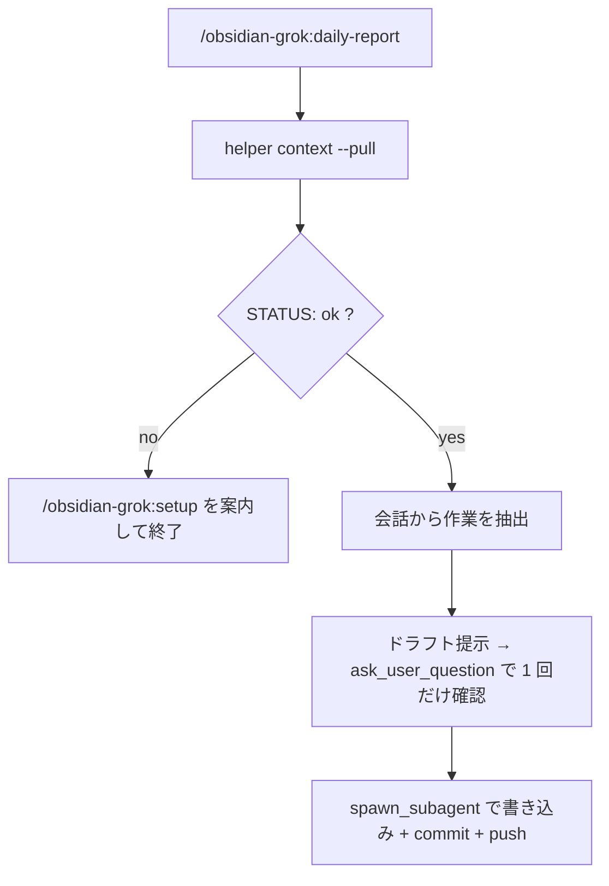

# obsidian-grok

セッションの作業内容を Obsidian vault のデイリーノートに日報として記録し、commit / push する plugin。Claude 版 `obsidian-cc` の移植。

- **skill `/obsidian-grok:daily-report`** — 今日の作業をデイリーノートに書く
- **skill `/obsidian-grok:setup`** — vault の設定 (`~/.grok/obsidian-grok.json`) を対話で作成・検証する

既存の `~/.claude/obsidian-cc.json` があれば読み取りフォールバックする。再セットアップは不要。

## 流れ



## 設定ファイル: `~/.grok/obsidian-grok.json`

```json
{
  "repoRoot": "/Users/you/work/Obsidian",
  "vaultDir": "/Users/you/work/Obsidian/notes",
  "remote": "origin",
  "branch": "main",
  "projectTag": "project"
}
```

- `vaultDir` は `repoRoot` 配下でなければならない
- 設定は helper の `write` 経由でのみ書く

## インストール

```bash
grok plugin marketplace add taichi0529/plugins-grok
grok plugin install obsidian-grok --trust
```

初回は `/obsidian-grok:setup` を実行する。

## 依存

- `jq`
- `git`
- `python3` (`allow-git` が `~/.grok/config.toml` を更新するとき)
