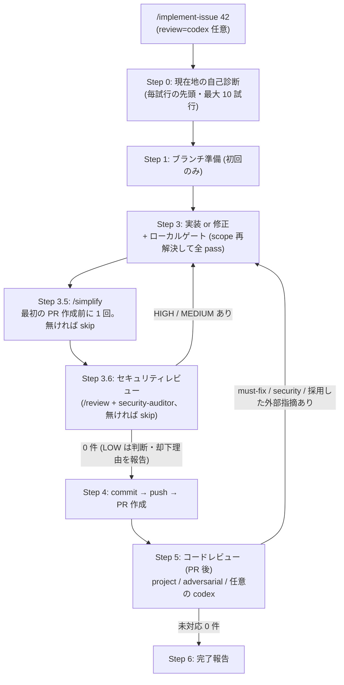
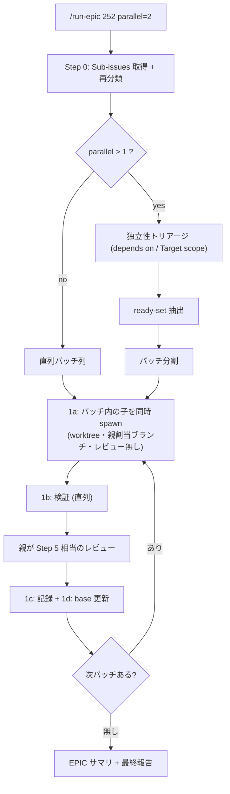

# workflow-grok

個人ワークフロー plugin。複数 issue 一括 + ループ実行ワークフローの汎用エンジン層。Claude Code 版 `workflow-cc` の Grok 移植。

## 構成

- **PROGRESS.md 永続化フック 3 本**
  - `SessionStart` — additionalContext で現在地注入を試す (Grok は stdout を無視する。skill 側も PROGRESS.md を読む)
  - `PreToolUse` (Bash) — `git commit` / `gh pr create` の**直前**に更新を強制 (主役)。ログ 10 件超の機械トリムも担当
  - `Stop` — バックストップ (`HEAD` が PROGRESS.md より 5 分以上新しければ block)
- **skills**
  - `implement-issue` — Issue を内部ループ (最大 10 試行) で end-to-end 実装。リポジトリ非依存 (`.grok/workflow-grok.json`、無ければ `.claude/workflow-cc.json`、どちらも無ければ自動導出)
  - `run-epic` — EPIC の OPEN な Sub-issues をオーケストレーション。既定は直列。Grok はサブエージェントをネストできないため、**レビューは親セッションが担当**し、子は実装 + ゲート + PR まで
  - `create-issue` — PBI 形式の Issue 起票。依存 (`depends on:`) と `Target scope` の機械可読宣言を含む

## implement-issue の実行フロー

各試行は Step 0 の自己診断から始まり、「次に必要な 1 歩」だけ進めてループ先頭へ戻る (最大 10 試行)。



- Step 3.5 / 3.6 は最初の PR 作成前だけ。docs-only や skill 不在は skip して最終報告に明記 (fail-open)
- 既定レビュアーは `["project", "adversarial"]`。`review=grok` は廃止 (本体が Grok)
- レビューは初回フル・2 回目以降は差分照合モード

## run-epic の実行フロー



## opt-in

フックは **リポジトリルートに `PROGRESS.md` が存在する時だけ** 動く。

```bash
touch PROGRESS.md
echo "PROGRESS.md" >> .gitignore
```

## リポジトリ設定: `.grok/workflow-grok.json`

全フィールド任意。無くても自動導出。既存の `.claude/workflow-cc.json` があればそれを読む。

```json
{
  "baseBranch": "main",
  "trustCI": true,
  "gates": ["npm run lint"],
  "reviewers": ["project"],
  "scopes": [
    { "paths": ["apps/web"], "gates": ["npm run lint -w web"], "reviewers": ["project"] },
    { "paths": ["backend"], "gates": ["make -C backend test"], "reviewers": ["project", "codex"] }
  ]
}
```

解決規則の正典は `skills/implement-issue/SKILL.md` の「リポジトリ設定の解決」。

## インストール

```bash
grok plugin marketplace add taichi0529/plugins-grok
grok plugin install workflow-grok --trust
```

ローカル:

```bash
grok plugin install /path/to/plugins-grok/plugins/workflow-grok --trust
```

フックの変更は Plugins タブの `r`、またはセッション再起動で反映される。

## PROGRESS.md テンプレート

```markdown
# PROGRESS (machine-local / gitignored)

## 現在地 (毎回上書き)
- 作業中: #<issue> <タイトル> / branch <name> / <状態>
- 未完: #A, #B
- 次の一手: <1 行>

## ログ (追記・新しい順・直近 10 件でトリム)
### YYYY-MM-DD #<issue> → <PR/結果>
- plan差分: <無ければ「なし」>
- 失敗: <試して駄目だったアプローチと理由>
- ハマり: <再発しそうな落とし穴>
```

書いてよいのは **git / issue に無い情報だけ**: plan との乖離・失敗アプローチと理由・ハマりどころ・次の一手。

## 依存

- `jq` (無い環境ではフックは何もせず exit 0)
- `git`
